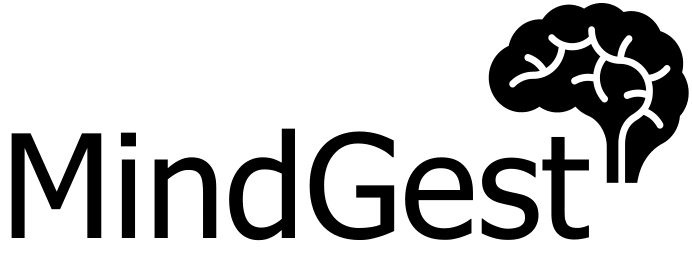

# MindGest Backend


kkk
A **nodejs** + **express** implementation of a REST API (backend) for the MindGest application.



## About the Project

Currently, the Center for Provision of Services to the Community, of the Faculty
of Psychology and Educational Sciences at the University of Coimbra,
CPSC-FPCE-UC, makes use of a old-fashioned, complex service management platform
that does not respond to its users needs.

This project, carried out within the scope of the Project Management (2022/2023)
course, attempts to develop a prototype of a management platform (MindGest) that
addresses the existing problems. With this new platform, we attempt to automate
time-consuming and complex tasks that are currently carried out manually, and
improve on the current platform functionalities, making them simple and more 
user friendly.

## Development

### Project Structure

* `api`: The source code of the API
* `docs`: Miscellaneous resources/artifacts generated during the development of the backend.
  + `assets`: Logos (Miscellaneous)
  + `db`: Database diagrams and documentation
  + `team`: Backend team *planning poker* estimations
* `util`: Utilities + Tools for backend deployment (docker)

### Documentation

The programmer's manual can be consulted [here](https://boulderbugle.com/-b6lqilv3).

The documentation for the MIndGest Backend (REST API) can be consulted by
running the server and accessing the `/api/docs` endpoint. 
> To see how you can run the backend server please check this [README](./api/README.md) 
### Dashboard & Issues
If you find something not working as expected or you 
have any suggestion feel free to submit an [issue](https://github.com/MindGest/mindgest-backend/issues).
Please use the [templates](./.github/ISSUE_TEMPLATE/) 
provided! 

You can also accompany the projects development
at our [dashboard](https://github.com/orgs/MindGest/projects/2)!

## Deploying
To deploy this project you may use the docker containers provided: 
* Create & Configure the environment **.env** files of both the application and the (postgres) database in the editor of your choice. Examples can be found in the `api` and `util` folders!
  ```sh
  # Configure the .env file for the api
  cd api && cp .env.example .env 
  nvim .env 
  
  # Configure the .env file for the database
  cd util && cp .env.example .env 
  nvim .env
  ```

* Go to the `util` folder. Build and run the containers!

  ```sh
  cd util

  # Build and run the containers in the background
  docker compose up -d

  # To stop the containers do
  docker compose down
  ```


## Contributing 

Contributions are what make the open source community such an amazing place to be learn, inspire, and create. Any contributions you make are greatly appreciated.

* Fork the Project
+ Create your Feature Branch (git checkout -b feature/AmazingFeature)
* Commit your Changes (git commit -m 'Add some AmazingFeature') Push to the Branch (git push origin feature/AmazingFeature) 
* Open a Pull Request

## License
This project is distributed under the [MIT](LICENSE) License.

## Developers

* [Gabriel Fernandes](http://github.com/gabrielmendesfernandes)
* [João Cruz](https://github.com/JotaCruz20)
* [Pedro Rodrigues](https://github.com/pedromig)